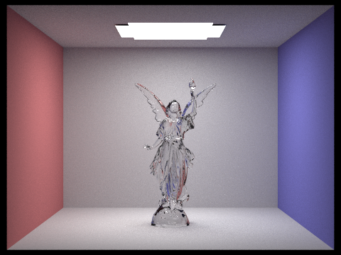
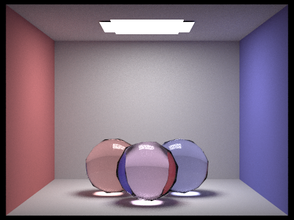

# Bidirectional Path Tracing

The bidirectional path tracing (BDPT) algorithm implemented in this repo is based on [Veach's paper](https://graphics.stanford.edu/papers/veach_thesis/thesis-bw.pdf), assignment codes from CSC4140@CUHKSZ and [cs184/284a@UCB](https://cs184.eecs.berkeley.edu/sp23). I strictly follow Veach's description with efficient roulette (by default roulette is not enabled) and support for delta surfaces. Following images are rendering results with 128 samples per pixel.






For more information on the performance, please see the [report](./report.md).

## Usage

Here are the steps to render with BDPT.

### Get the Code

```bash
git clone https://github.com/dongmingli-Ben/bidirectional-pathtracing.git
cd bidirectional-pathtracing
```

### Build

The codes require OpenGL. You can use the prepared script to install the prerequisites:

```bash
bash install_dependencies.sh
```

To build the executable with CMake, use the script:

```bash
bash compile.sh
```

### Run

Some `dae` scene files are provided in [`dae`](./dae/). You can render them with the following command:

```bash
./build/pathtracer -t 4 -s 4 -m 5 [-f <save-path>] -r 480 360 <path-to-dae-file>
```

#### Options

Here are some frequently used options:

- `-t`: number of threads to run in concurrent
- `-s`: number of samples per pixel
- `-r`: size of the rendered image
- `-m`: length of the light and eye subpaths generated
- `-f`: path to save the rendered image if it is set. If it is not set, a window will pop up with the rendered image

#### Display

If you are running the code in a virtual machine and you want the rendered image to be displayed in a window, you can use X11 forwarding. A script has been provided:

```bash
source ./config.sh
```

Also set up client on your local machine with [instructions here](https://zhuanlan.zhihu.com/p/461378596). Then you can run the executable in the same terminal.