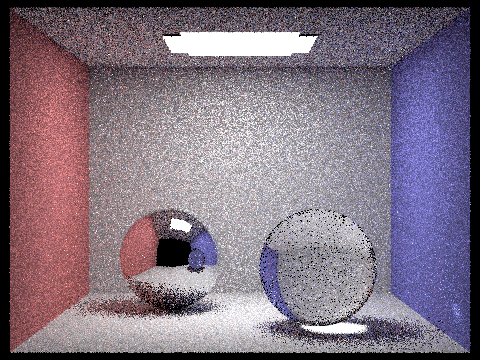
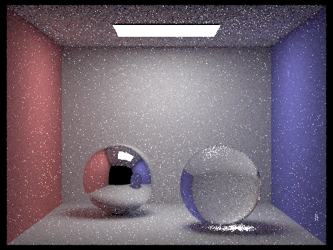

# Bidirectional Path Tracing

In this project, I implemented the bidirectional path tracing (BDPT) algorithm based on [Veach's paper](). I strictly follow Veach's description with efficient roulette and support for delta surfaces. Following images are rendering results with 128 samples per pixel.

## BDPT

Bidirectional path tracing is a rendering algorithm that improves upon the limitations of traditional path tracing by integrating light paths from both the camera and light sources. It combines the benefits of both backward and forward tracing to achieve more accurate and efficient global illumination simulations.

In bidirectional path tracing, light transport paths are traced both from the camera (known as eye paths) and from the light sources (known as light paths). Eye paths start from the camera and progress through the scene by bouncing off surfaces until they intersect a light source or reach the maximum path depth. Light paths, on the other hand, originate from the light sources and propagate towards the scene objects.

The algorithm connects the paths from both directions by combining sub-paths that is not occluded by other objects in the scene. By using Monte Carlo integration, it estimates the radiance at each pixel by sampling and evaluating the combined paths.

The advantage of bidirectional path tracing is that it reduces noise and improves convergence compared to traditional path tracing algorithms, especially in scenarios with complex lighting and occlusion. However, it can be computationally expensive due to the increased number of paths traced.

To further enhance performance, techniques like path guiding, multiple importance sampling, and Russian roulette can be employed in conjunction with bidirectional path tracing. These methods aim to prioritize and efficiently sample important paths to reduce noise and accelerate convergence in the final rendered image.

### Sampling Eye and Light Subpaths

The objective of path tracing is to estimate the illuminance at a certain image position, i.e.:

$$
I_j=\int_{\Omega}f_j(\bar{x})d\mu(\bar{x})
$$

where $\bar{x}$ is a path from eye to a light source with $k$ vertices and $d$, and $d\mu(\bar{x})$ is the area product measure. The value can be estimated with Monte Carlo samples:

$$
f_j(\bar{x})=L_e(x_0\rightarrow x_1)G(x_0\leftrightarrow x_1)W_e^{j}(x_{k-1}\rightarrow x_{k})\prod_{i=1}^{k-1}f_s(x_{i-1}\rightarrow x_i\rightarrow x_{i+1})G(x_i\leftrightarrow x_{i+1})
$$

In BDPT, $\bar{x}$ is sampled from both the light source and the eye/camera. Suppose for a $\bar{x}$ obtained from a light subpath with $s$ vertices and an eye subpath with $t$ vertices, the corresponding sampling PDF is

$$
p_{s,t}(\bar{x}_{s,t})=p_s^L\cdot p_t^E\\
p_0^L=1,p_1^L=P_A(y_0),p_i^L=p_{\sigma^{\perp}}G(y_{i-2}\leftrightarrow y_{i-1}),i\geqslant 2\\
p_0^E=1,p_1^E=P_A(z_0),p_i^L=p_{\sigma^{\perp}}G(z_{i-2}\leftrightarrow z_{i-1}),i\geqslant 2\\
$$

where $y_i$ are vertices on the light subpath and $z_i$ are vertices on the eye subpath.

Plug it in the Monte Carlo sampling formula, each sample has a contribution of:

$$
\frac{f_j(\bar{x}_{s,t})}{p_{s,t}(\bar{x}_{s,t})}=\alpha_s^Lc_{s,t}\alpha_t^E=C_{s,t}\\
\alpha_0^L=1,\alpha_1^L=\frac{L_e^{(0)}(y_0)}{p_A(y_0)},\alpha_i^{L}=\frac{f_s(y_{i-3}\rightarrow y_{i-2}\rightarrow y_{i-1})}{p_{\sigma^{\perp}}(y_{i-2}\rightarrow y_{i-1})}\alpha_{i-1}^L,i\geqslant 2\\
\alpha_0^E=1,\alpha_1^E=\frac{W_e^{(0)}(z_0)}{p_A(z_0)},\alpha_i^{L}=\frac{f_s(z_{i-1}\rightarrow z_{i-2}\rightarrow z_{i-3})}{p_{\sigma^{\perp}}(z_{i-2}\rightarrow z_{i-1})}\alpha_{i-1}^E,i\geqslant 2\\
c_{0,t}=L_e(z_{t-1}\rightarrow z_{t-2})\\
c_{t,0}=W_e(y_{s-2}\rightarrow y_{s-1})\\
c_{s,t}=f_s(y_{s-2}\rightarrow y_{s-1} \rightarrow y_{t-1})G(y_{s-1}\leftrightarrow z_{t-1})f_s(y_{s-1}\rightarrow z_{t-1}\rightarrow z_{t-2}),s,t>0
$$

However, the above formula presented in Veach's paper does not seem to reconcile with the formula of unidirectional path tracing. To align these two, I correct them to:

$$
\alpha_i^{L}=\frac{f_s(y_{i-3}\rightarrow y_{i-2}\rightarrow y_{i-1})\cos\theta_{y_{i-2}\rightarrow y_{i-1}}}{p_{\sigma^{\perp}}(y_{i-2}\rightarrow y_{i-1})}\alpha_{i-1}^L,i\geqslant 2\\
\alpha_i^{E}=\frac{f_s(z_{i-1}\rightarrow z_{i-2}\rightarrow z_{i-3})\cos\theta_{z_{i-2}\rightarrow z_{i-1}}}{p_{\sigma^{\perp}}(z_{i-2}\rightarrow z_{i-1})}\alpha_{i-1}^E,i\geqslant 2
$$

### Sampling Initial Ray on Light Sources

Different from unidirectional path tracing, BDPT requires sampling the light sources. Here is a brief description of how to sample the light sources:

1. uniformly choose a light source from the scene
2. sample a point as the initial vertex of the light subpath on the light surface with PDF being $p_A(y_0)$
2. sample a direction for the initial ray with PDF being $p(y_0\rightarrow y_1|y_0)$

Using area light source as an example:

1. randomly choose a point on the area light source
2. set $p_A(y_0)$ to $\frac1A$, where $A$ is the area of the light
3. sample a direction with cosine-weighted hemisphere sampler and set the corresponding pdf to $p(y_0\rightarrow y_1|y_0)$

### Sampling Initial Ray on Eye

For simplicity, this project only supports pinhole camera model since lens models require complicated sampling.

There are two cases for sampling eye vertex, which require different treatments. In the ordinary case where we generate a eye subpath from the initial eye vertex, since we uniformly sample from the image plane that corresponds to the pixel $I_j$, we set $p_A(z_0)=1$ and $p(z_0\rightarrow z_1|z_0)=1$.

The other case requires more complex treatment. When we connect a light subpath with an eye subpath which only has one vertex, the corresponding ray will not contribute to the pixel $I_j$. To efficiently use this sample, we need to sample another eye vertex and update the contribution to that pixel in the light image instead. To this end, we need to find $f_s(z_1\rightarrow z_0\rightarrow z_{-1})=W^{(1)}_e(z_0,\omega)$ that satisfies:

$$
\int_D W_e^{(1)}(z_0,\omega)d\sigma^{\perp}(\omega)
$$

> is equal to the fraction of the image region covered by the points (u, v) that are mapped by the lens to directions $\omega\in D$

Although the computation is complicated, fortunately according to [Physically Based Rendering: From Theory To Implementation](https://www.pbr-book.org/3ed-2018/Light_Transport_III_Bidirectional_Methods/The_Path-Space_Measurement_Equation#PerspectiveCamera::We), the final result for a pinhole camera model is $\frac{(1,1,1)}{A\cdot\cos^4\theta}$, where $A$ is the corresponding physical plane size corresponding to the $1\times 1$ image plane and $\theta$ is the angle between the ray and the normal vector of the eye point (for a pinhole model, it is the direction of the camera). The corresponding PDF for the ray direction is $\frac{d^2}{\cos\theta}$ where $d$ is the distance between the eye point and the next point on the path.

### Multiple Importance Sampling (MIS)

Multiple importance sampling is a technique used in rendering algorithms, including bidirectional path tracing, to improve the efficiency of sampling light transport paths. It combines multiple sampling strategies to reduce noise and improve convergence by giving more importance to paths that contribute significantly to the final image.

In bidirectional path tracing, there are two types of paths: eye paths (traced from the camera) and light paths (traced from the light sources). Each path contributes differently to the final image depending on the scene configuration and the materials involved. Some paths may carry more illumination while others may have higher probabilities of being sampled accurately.

MIS addresses this issue by using a combination of different sampling techniques, such as path sampling, light sampling, and direct sampling. It assigns weights to each technique based on their relative importance for a given path. These weights are determined using heuristics like balance heuristics, power heuristics, or other more sophisticated techniques.

By employing MIS, bidirectional path tracing can intelligently choose between different sampling strategies for each path, giving more importance to the techniques that have a higher probability of generating low-variance samples. This helps in reducing noise and improving convergence, leading to more accurate and visually pleasing rendered images.

In summary, multiple importance sampling allows bidirectional path tracing to adaptively select the most suitable sampling strategies for different light transport paths, resulting in more efficient and effective rendering of complex scenes with various lighting conditions and materials.

#### Implementation

For a certain path length of $k$ ($k=s+t$), there are $k$ kinds of sampling strategies, where $t=1,2,...,k$. Each of these have different noise. MIS works by attribute more weight to the samples with less variance. The way to identify which sampling strategy is of less variance is by heuristics.

The samples with lower probability usually have higher variance. This heuristics coincides with the efficient sampling of rare events. Therefore, the final weight for $C_{s,t}$ is:

$$
w_{s,t}=\frac{p^2_{s}}{\sum_{i=0}^{k-1}p_i^2}
$$

where $p_i$ is the probability that the path is sampled with $i$ vertices from the light subpath and $k-i$ vertices from the eye subpath. The weights can be calculated rather efficiently with the fact that:

$$
\frac{p_1}{p_0}=\frac{p_A(x_0)}{p_{\sigma^{\perp}}(x_1\rightarrow x_0)G(x_1\leftrightarrow x_0)}\\
\frac{p_{i+1}}{p_i}=\frac{p_{\sigma^{\perp}}(x_{i-1}\rightarrow x_i)G(x_{i-1}\leftrightarrow x_i)}{p_{\sigma^{\perp}}(x_{i+1}\rightarrow x_i)G(x_{i+1}\leftrightarrow x_i)},i=1,...,k-1
$$

### Specular Effects

It is simple to handle specular surfaces such as perfect reflection and refraction. When we encounter a specular surface, we simply replace $p$ with the coefficient of proportion for the Dirac delta distribution. There is no special treatment for calculation of the unweighted contribution $C_{s,t}$. Special handling for specular surface is only needed when calculating the weight. Fortunately, the Dirac delta distribution cancels each other except for a few vertices.

> The end result is particularly simple: we first compute all of the pi exactly as we would for non-specular vertices, without regard for the fact the some of the densities are actually coefficients for Dirac distributions. Then for every vertex where $x_j$ is specular, we set $p_j$ and $p_{j+1}$ to zero (since these probabilities include a symbolic Dirac distribution in the denominator)

## Results and Discussion

### Comparison Between BDPT and Ordinary Path Tracing

Following are rendering results from both methods with 1, 4, and 32 samples per pixel.

#### 1 Sample Per Pixel

BDPT (in 12s):

Unidirectional (in 12s, 16 samples per light, max 8 bounces):

#### 4 Samples Per Pixel

BDPT (in 41s):

Unidirectional (in 44s, 16 samples per light, max 8 bounces):

#### 32 Samples Per Pixel

BDPT (in 308s):

Unidirectional (in 307s, 16 samples per light, max 8 bounces):

From above results, BDPT achieves better noise level when using the same time as unidirectional path tracing.

#### Cases Where Lights Are Occluded

BDPT:

Unidirectional:

From the result, BDPT is particularly effective when the light sources are occluded.

### Impact of MIS

Direct illuminance with average weight:

Direct illuminance with MIS:

